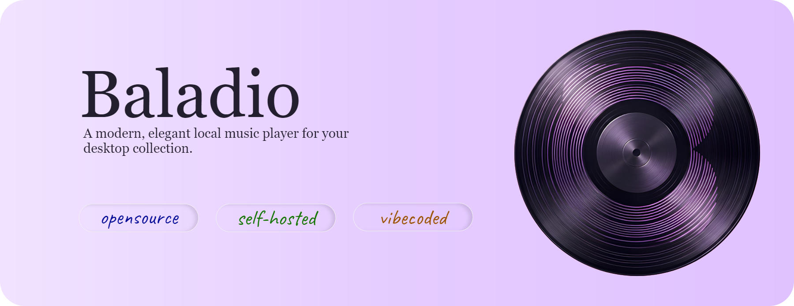

<div align="center">



# Baladio
In French, baladeur is a noun that means a personal stereo, portable music player, or walkman. `Baladio` is a combination for "baladeur" and "audio". Pronounciation: **bah-LAH-dee-oh.**

**A self-hosted, privacy-first local music player with a glassmorphism UI, spatial audio, and listening analytics.**


[Features](#features) · [Getting Started](#getting-started) · [Screenshots](#screenshots) · [Keyboard Shortcuts](#keyboard-shortcuts) · [License](#license)

</div>

---

## Features

- **Local-first** — plays audio files directly from your machine. No accounts, no streaming, no tracking.
- **OS Media Controls** — full Media Session API integration for hardware media keys, lock screen playback controls, and native OS overlay metadata (title, artist, cover art).
- **Spatial 8D Audio** — HRTF-based binaural panning using the Web Audio API. Rotation continues even when the browser tab is in the background (pre-scheduled via AudioContext automation).
- **Reverb & Deep effects** — convolution reverb with synthetic impulse response + pitch-shifted bass boost.
- **Effect Config panel** — live-tune 8D speed, reverb wet/dry, and reverb tail.
- **Playback speed** — 0.5× to 2× with a dedicated speed input that can also accept mouse scroll.
- **Playlist management** — create, rename, delete, reorder (drag-to-rearrange), and set custom covers for playlists.
- **Queue & Up Next** — intelligent queue progression with sleek "Up Next" toast notifications sliding in 10 seconds before the current track ends.
- **Global Search** — glassmorphic dropdown search to instantly filter all songs by title or artist, showing playlist tags and direct add-to-playlist buttons.
- **Listening analytics** — home dashboard with top song, top artist, hottest playlist, plays today, artists explored, and day streak. Songs are counted after 20 seconds of playback. History stored server-side in `data/history.json`.
- **Recently Played** — horizontal scroll strip on the home page.
- **Download with effects** — exports the song with the current effect chain applied (8D, reverb, speed) as an mp3 file using `OfflineAudioContext`.
- **Cover art** — reads embedded ID3 tags for MP3s, extracts the first frame of MP4s via ffmpeg, and supports custom uploaded covers.
- **Metadata editing** — edit title/artist per song; writes to ID3 tags for MP3s.
- **File rename** — renames the audio file on disk to `{Artist} - {Title}.ext` from metadata.
- **Synced Lyrics** — real-time synchronized lyrics fetched silently in the background via [LRCLIB](https://lrclib.net/). Displays a scrolling karaoke-style lyrics panel in the fullscreen view. Supports two layouts: **side** (album art + lyrics side by side) and **top** (Apple Music-style centered stack showing 2 prev/active/2 next lines). Layouts can be changed by dragging the lyrics panel to a drop zone. Local `.lrc` files in the songs directory are prioritised over online lookups.
- **Notification Centre** — in-app notification system for background events. When an exact lyrics match cannot be found, a "fuzzy match" notification is raised with up to 5 candidate results (showing track name, artist, album, and duration). The user can open the notification, select the correct match, and confirm — the lyrics are saved and loaded instantly without a reload. Duplicate notifications for the same song are suppressed.

---


## Requirements

- [Node.js](https://nodejs.org/) 18 or higher
- npm (comes with Node.js)

---

## Getting Started

### 1. Clone the repository

```bash
git clone https://github.com/rxdwan/baladio.git
cd Baladio
```

### 2. Install dependencies

```bash
npm install
```

### 3. Add your music

Create a `songs/` folder **one level above** `Baladio/` and drop your `.mp3` or `.mp4` files inside:

```
your-folder/
├── songs/               ← your audio files go here
│   ├── song1.mp3
│   └── song2.mp4
└── Baladio/             ← this repo
    ├── covers/          ← auto-created on first run
    ├── data/            ← auto-created on first run
    ├── public/
    ├── server.js
    └── package.json
```

### 4. Start the server

```bash
node server.js
```

Then open [http://localhost:3000](http://localhost:3000) in your browser.

### Optional: 

- Create a `.vbs` file in your Windows Startup folder (`shell:startup`) to launch the server silently on login:

```vbs
Set objShell = CreateObject("WScript.Shell")
objShell.Run "cmd /c cd /d C:\path\to\music_player && node server.js", 0, False
```

- To stop the server, paste this into a `.bat` file:

```bat
@echo off
setlocal enabledelayedexpansion

set PORT=3000
set FOUND=0

for /f "tokens=5" %%P in ('netstat -ano ^| findstr ":%PORT% " ^| findstr "LISTENING"') do (
    set FOUND=1
    taskkill /PID %%P /F >nul 2>&1
)

if "%FOUND%"=="0" (
    echo No server found running on port %PORT%.
) else (
    echo Server on port %PORT% stopped successfully.
)

if /I not "%~1"=="silent" pause
```

---

## Screenshots

<table>
    <tr><td><h3>Home page</h3><td></tr>
    <tr>
        <td><br><sub>Home Page Light</sub></td>
        <td><br><sub>Home Page Dark</sub></td>
    </tr>
    <tr><td><h3>Explore page</h3><td></tr>
    <tr>
        <td><br><sub>Explore Page Light</sub></td>
        <td><br><sub>Explore Page Dark</sub></td>
    </tr>
    <tr><td><h3>Playlist page</h3><td></tr>
    <tr>    
        <td><br><sub>Playlist Page Light</sub></td>
        <td><br><sub>Playlist Page Light</sub></td>
    </tr>
</table>

---

<table>
    <tr>
        <td><br><sub>An example playlist</sub></td>
        <td><br><sub>Fullscreen (same for light/dark theme)</sub></td>
    </tr>
    
</table>

---

## Keyboard Shortcuts

| Key | Action |
|-----|--------|
| `Space` | Play / Pause |
| `F` | Toggle fullscreen |
| `M` | Mute / Unmute |
| `Esc` | Back|
| `→` | Move 5 seconds ahead |
| `←` | Move 5 seconds behind |
| `Shift` + `→` | Next track |
| `Shift` + `←` | Previous track |


---

## Project Structure

```
Baladio/
├── covers/
│   ├── songs/           song cover images ({uuid}.jpg)
│   ├── playlists/       playlist cover images ({id}.jpg)
│   └── default_song_cover.jpg
├── data/
│   ├── metadata.json    custom title/artist metadata and filename mappings
│   ├── playlists.json   user created playlists
│   └── history.json     server-side play history
├── public/
│   ├── app.js           all frontend logic
│   ├── index.html       app shell
│   ├── style.css        all styles
│   └── icons.js         SVG icon library
└── server.js            Express API server
```

---


## Acknowledgements

Built with:
- [Express.js](https://expressjs.com/) — Node.js web framework
- [music-metadata](https://github.com/borewit/music-metadata) — audio tag parsing
- [node-id3](https://github.com/Zazama/node-id3) — MP3 ID3 tag writing
- [fluent-ffmpeg](https://github.com/fluent-ffmpeg/node-fluent-ffmpeg) — MP4 thumbnail extraction
- [better-sqlite3](https://github.com/WiseLibs/better-sqlite3) — local SQLite database for notifications & lyrics cache
- [LRCLIB](https://lrclib.net/) — free, open-source synced lyrics API
- Web Audio API — 8D spatial audio, reverb, and offline rendering

---

## License

[](https://www.gnu.org/licenses/gpl-3.0)